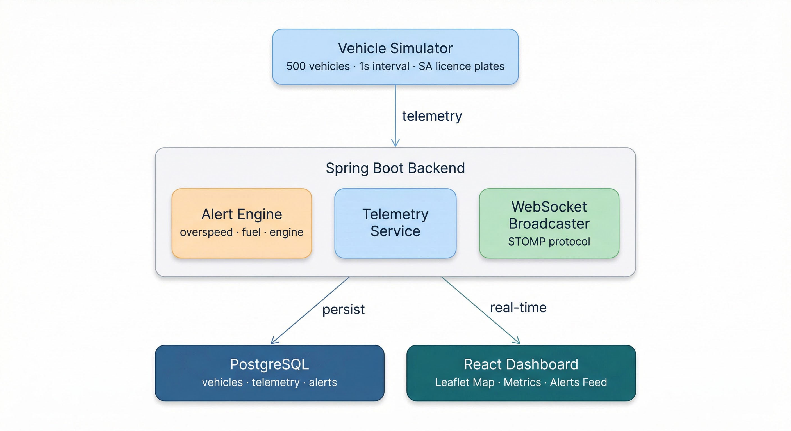

# Real-Time Fleet Monitoring Platform

A full-stack real-time fleet monitoring system I designed and built to demonstrate enterprise-grade telemetry streaming, event-driven architecture, and live geospatial visualization. The platform simulates 500 vehicles operating across the Gauteng province in South Africa, streaming telemetry data through WebSockets and rendering live movement on an interactive dark-themed dashboard.

## Motivation

I wanted to build something that goes beyond typical CRUD applications -- a system that handles real-time data at scale, processes events as they happen, and presents operational insights through a purpose-built interface. Fleet monitoring sits at the intersection of IoT, streaming data, and geospatial visualization, making it an ideal domain to showcase these capabilities.

## Architecture

The system follows an event-driven pipeline. The vehicle simulator generates telemetry every second for 500 vehicles with South African licence plates (weighted toward Gauteng). Each reading flows through the alert engine, which evaluates business rules and flags violations. Data is persisted to PostgreSQL for historical queries while simultaneously being pushed to connected clients via STOMP over WebSocket. The React dashboard consumes both REST (initial state) and WebSocket (live updates) endpoints.

## Tech Stack

| Layer      | Technology                                              |
| ---------- | ------------------------------------------------------- |
| Backend    | Java 17, Spring Boot 3.2, Spring Data JPA, STOMP WS    |
| Frontend   | React 19, TypeScript, Vite, Tailwind CSS 4, Leaflet    |
| State      | Zustand (lightweight, optimized for high-frequency updates) |
| Database   | PostgreSQL 16                                           |
| DevOps     | Docker, Docker Compose, multi-stage builds, nginx       |
| Fonts      | Inter, JetBrains Mono                                   |

## Features

| Feature                | Description                                                                 |
| ---------------------- | --------------------------------------------------------------------------- |
| Live GPS Tracking      | 500 simulated vehicles with realistic momentum-based movement across Gauteng |
| SA Licence Plates      | Vehicles use province-weighted plate format (e.g. `GP 482 BKT`, `KZN 091 FXR`) |
| Real-Time Streaming    | STOMP WebSocket pushes batched telemetry every second, no page refresh      |
| Alert Engine           | Evaluates overspeed, low fuel, and engine overheat with severity tiers      |
| Interactive Dashboard  | Dark-themed operational UI with live map, metrics panel, and alerts feed    |
| Alert Controls         | Toggle live alerts on/off, filter by type (speed, fuel, engine)            |
| Historical Persistence | Full telemetry and alert history stored and queryable in PostgreSQL         |

## Alert Rules

| Condition              | Alert Type       | Warning Threshold | Critical Threshold |
| ---------------------- | ---------------- | ----------------- | ------------------ |
| Speed > 120 km/h       | `OVERSPEED`      | 120 -- 140 km/h   | > 140 km/h        |
| Fuel < 15%             | `LOW_FUEL`       | 10 -- 15%         | < 10%             |
| Engine Temp > 100°C    | `ENGINE_OVERHEAT`| 100 -- 110°C      | > 110°C           |

Alerts include a 30-second cooldown per vehicle per alert type to avoid flooding the database and the frontend feed.

## Database Schema

### `vehicles` -- Last-known state (updated every tick)

| Column            | Type        | Description                     |
| ----------------- | ----------- | ------------------------------- |
| `id`              | `BIGINT PK` | Auto-generated primary key     |
| `vehicle_id`      | `VARCHAR`   | Unique SA licence plate         |
| `last_latitude`   | `DOUBLE`    | Most recent latitude            |
| `last_longitude`  | `DOUBLE`    | Most recent longitude           |
| `last_speed`      | `DOUBLE`    | Speed in km/h                   |
| `last_fuel_level` | `DOUBLE`    | Fuel percentage (0--100)        |
| `last_engine_temp`| `DOUBLE`    | Engine temperature in °C        |
| `last_updated`    | `TIMESTAMP` | Time of last telemetry reading  |

### `telemetry` -- Append-only telemetry log

| Column        | Type        | Description                          |
| ------------- | ----------- | ------------------------------------ |
| `id`          | `BIGINT PK` | Auto-generated primary key          |
| `vehicle_id`  | `VARCHAR`   | SA licence plate (indexed)           |
| `latitude`    | `DOUBLE`    | GPS latitude                         |
| `longitude`   | `DOUBLE`    | GPS longitude                        |
| `speed`       | `DOUBLE`    | Speed in km/h                        |
| `fuel_level`  | `DOUBLE`    | Fuel percentage                      |
| `engine_temp` | `DOUBLE`    | Engine temperature in °C             |
| `timestamp`   | `TIMESTAMP` | Time of reading (indexed)            |

### `alerts` -- Alert event log

| Column       | Type        | Description                                          |
| ------------ | ----------- | ---------------------------------------------------- |
| `id`         | `BIGINT PK` | Auto-generated primary key                          |
| `vehicle_id` | `VARCHAR`   | SA licence plate (indexed)                           |
| `alert_type` | `VARCHAR`   | Enum: `OVERSPEED`, `LOW_FUEL`, `ENGINE_OVERHEAT`    |
| `severity`   | `VARCHAR`   | Enum: `WARNING`, `CRITICAL`                          |
| `message`    | `VARCHAR`   | Human-readable alert description                     |
| `timestamp`  | `TIMESTAMP` | Time alert was generated (indexed)                   |

## REST API

| Method | Endpoint                         | Description                              |
| ------ | -------------------------------- | ---------------------------------------- |
| GET    | `/api/vehicles`                  | All vehicles with last-known state       |
| GET    | `/api/vehicles/{vehicleId}`      | Single vehicle detail by plate ID        |
| GET    | `/api/alerts?type=&limit=`       | Recent alerts, optional type filter      |
| GET    | `/api/alerts/{vehicleId}`        | Alert history for a specific vehicle     |
| GET    | `/api/telemetry/{vehicleId}`     | Telemetry history with optional date range |

## WebSocket Topics

| Destination         | Direction        | Description                              |
| ------------------- | ---------------- | ---------------------------------------- |
| `/topic/vehicles`   | Server to Client | Batched vehicle telemetry (chunks of 50) |
| `/topic/alerts`     | Server to Client | Individual alert events in real-time     |
| `/app/toggleAlerts` | Client to Server | Toggle alert broadcasting on/off         |

## Key Design Decisions

| Decision | Rationale |
| -------- | --------- |
| **Telemetry batching (chunks of 50)** | Sending 500 individual WebSocket frames per second would overwhelm the browser. Batching into ~10 frames keeps latency under 1 second while reducing connection pressure. |
| **Zustand over Redux** | With 500 vehicles updating every second, minimal overhead matters. Zustand has no boilerplate, no providers, and direct store subscriptions avoid unnecessary re-renders. |
| **STOMP over raw WebSocket** | STOMP provides topic-based pub/sub natively, which maps cleanly to the vehicle and alert channels. Spring has first-class STOMP support with `SimpMessagingTemplate`. |
| **Separate vehicles + telemetry tables** | The `vehicles` table holds only the latest state (fast dashboard reads), while `telemetry` is append-only history. This avoids expensive queries on a high-volume table. |
| **Persistent heading in simulator** | Vehicles maintain a direction of travel that drifts gradually instead of random-walking. Combined with momentum-based speed, this produces realistic-looking movement on the map. |
